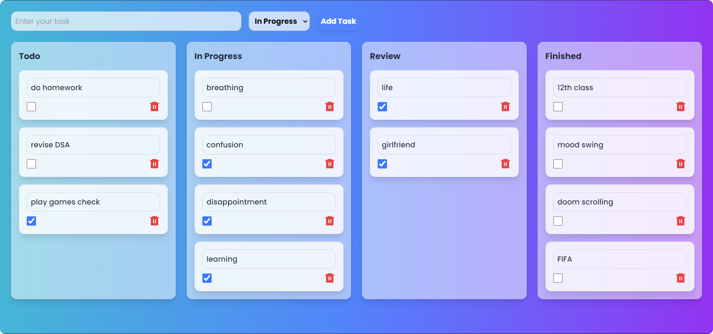

# **Task Management App**

A beautiful and functional task management application built with **React** and **Redux**. It includes modern **glassmorphism** design and vibrant gradients, making task organization visually appealing and user-friendly.

---

## **Features**

- **Task Management:**
  - Add tasks with status options (Todo, In Progress, Review, Finished).
  - Edit and delete tasks easily.
- **Modern UI:**
  - Glassmorphism effect on task cards and columns.
  - Responsive design for all devices.
- **Dynamic Interactions:**
  - Real-time updates for task status.
  - Hover animations for cards and buttons.
- **Gradients and Themes:**
  - A vibrant gradient background for a modern look.

---

## **Technologies Used**

- **Frontend:**
  - React
  - Redux Toolkit (for state management)
  - Tailwind CSS (for styling)
- **Icons:**
  - React Icons (for delete and interactive icons)

---
